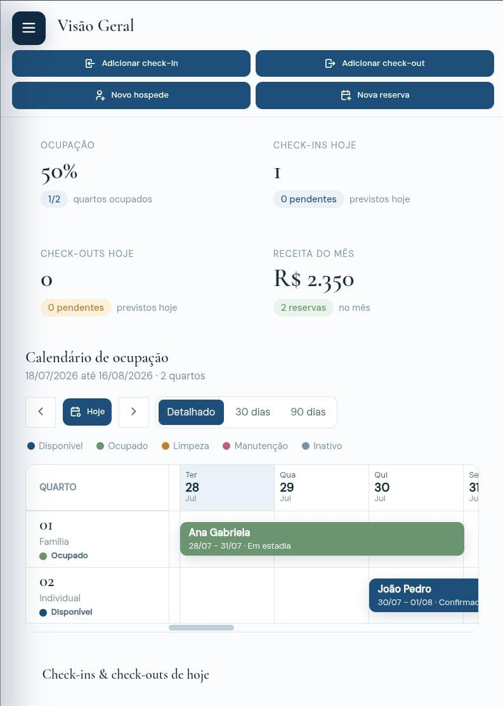

# HouseHost — gestão operacional, financeira e de privacidade para hospedagens

        

## Resumo

O HouseHost é um sistema para gestão operacional, financeira e de privacidade de pousadas, casas de temporada, pequenos hotéis e hospedagens independentes. A aplicação centraliza hóspedes, acomodações, reservas, check-in, check-out, caixa, transações financeiras, parcelamentos, métricas, usuários, fornecedores, auditoria e governança LGPD em uma API REST construída com Java e Spring Boot.

O backend segue arquitetura hexagonal dentro de um monólito modular. Cada contexto separa domínio, casos de uso, portas e adaptadores. Regras de negócio não ficam presas a controllers, JPA, JWT ou ao frontend, permitindo que novas interfaces consumam a mesma aplicação sem duplicar o núcleo funcional.

O painel administrativo está organizado em `frontend/admin`. O backend também possui um contrato público pronto para receber um site institucional e um fluxo de reservas: visitantes podem consultar acomodações, verificar disponibilidade, solicitar cotação e cadastrar uma reserva pública com aceite versionado da política de privacidade.

Na prática, o HouseHost oferece uma estrutura para:

- administrar hóspedes, acomodações, reservas e hospedagens;
- executar check-in e check-out com regras próprias de domínio;
- registrar receitas, despesas, liquidações, caixa e parcelamentos;
- consultar métricas operacionais e financeiras;
- autenticar usuários com senha protegida e token JWT;
- autorizar operações de acordo com o perfil do usuário;
- receber reservas originadas de um site público;
- manter inventário das operações de tratamento de dados pessoais;
- avaliar, revisar, aprovar e versionar bases legais;
- criar, publicar e disponibilizar versões verificáveis da política de privacidade;
- mascarar dados pessoais conforme o nível de acesso;
- manter trilha de auditoria vinculada às operações de tratamento;
- governar fornecedores, operadores, contratos, riscos e destino dos dados.

| Sistema de autenticação | Dashboard administrativo | Responsivo para tablet |
| --- | --- | --- |
|  |  |  |

## Sumário

- [1. Introdução e motivação](#1-introdução-e-motivação)
  - [1.1. HouseHost como base para gestão de hospedagens](#11-househost-como-base-para-gestão-de-hospedagens)
  - [1.2. Escopo funcional](#12-escopo-funcional)
- [2. Arquiteturas do projeto](#2-arquiteturas-do-projeto)
  - [2.1. Arquitetura do backend](#21-arquitetura-do-backend)
    - [2.1.1. Arquitetura hexagonal](#211-arquitetura-hexagonal)
    - [2.1.2. Direção das dependências](#212-direção-das-dependências)
    - [2.1.3. Organização do backend](#213-organização-do-backend)
    - [2.1.4. Submódulos hexagonais de privacy](#214-submódulos-hexagonais-de-privacy)
  - [2.2. Arquitetura do frontend](#22-arquitetura-do-frontend)
    - [2.2.1. Organização do frontend](#221-organização-do-frontend)
    - [2.2.2. Inicialização e autenticação](#222-inicialização-e-autenticação)
    - [2.2.3. Cliente da API e sessão local](#223-cliente-da-api-e-sessão-local)
    - [2.2.4. Controller de interface e navegação](#224-controller-de-interface-e-navegação)
    - [2.2.5. Views e widgets](#225-views-e-widgets)
    - [2.2.6. Permissões e responsividade](#226-permissões-e-responsividade)
- [3. Protocolos, DTOs e segurança](#3-protocolos-dtos-e-segurança)
  - [3.1. Protocolo de response](#31-protocolo-de-response)
  - [3.2. DTOs de entrada e saída](#32-dtos-de-entrada-e-saída)
  - [3.3. Autenticação e autorização](#33-autenticação-e-autorização)
  - [3.4. Proteção de login](#34-proteção-de-login)
- [4. Fluxo de request e response](#4-fluxo-de-request-e-response)
  - [4.1. Fluxo administrativo autenticado](#41-fluxo-administrativo-autenticado)
  - [4.2. Fluxo de reserva pública](#42-fluxo-de-reserva-pública)
  - [4.3. Fluxo do painel administrativo](#43-fluxo-do-painel-administrativo)
- [5. Módulos da aplicação](#5-módulos-da-aplicação)
  - [5.1. Autenticação e segurança](#51-autenticação-e-segurança)
  - [5.2. Hóspedes](#52-hóspedes)
  - [5.3. Acomodações](#53-acomodações)
  - [5.4. Reservas, check-in e check-out](#54-reservas-check-in-e-check-out)
  - [5.5. Financeiro e caixa](#55-financeiro-e-caixa)
  - [5.6. Métricas](#56-métricas)
  - [5.7. API pública](#57-api-pública)
  - [5.8. Auditoria](#58-auditoria)
  - [5.9. Privacidade](#59-privacidade)
  - [5.10. Fornecedores](#510-fornecedores)
- [6. API REST](#6-api-rest)
  - [6.1. Endpoints públicos](#61-endpoints-públicos)
  - [6.2. Endpoints administrativos](#62-endpoints-administrativos)
  - [6.3. Perfis de acesso](#63-perfis-de-acesso)
- [7. LGPD e privacidade por construção](#7-lgpd-e-privacidade-por-construção)
  - [7.1. Inventário das operações de tratamento](#71-inventário-das-operações-de-tratamento)
  - [7.2. Avaliação e versionamento das bases legais](#72-avaliação-e-versionamento-das-bases-legais)
  - [7.3. Referências legais centralizadas](#73-referências-legais-centralizadas)
  - [7.4. Necessidade e minimização](#74-necessidade-e-minimização)
  - [7.5. Transparência e registro do aceite](#75-transparência-e-registro-do-aceite)
  - [7.6. Política de privacidade](#76-política-de-privacidade)
  - [7.7. Controle de acesso e mascaramento](#77-controle-de-acesso-e-mascaramento)
  - [7.8. Segurança dos dados pessoais](#78-segurança-dos-dados-pessoais)
  - [7.9. Auditoria e prestação de contas](#79-auditoria-e-prestação-de-contas)
  - [7.10. Governança de fornecedores e operadores](#710-governança-de-fornecedores-e-operadores)
  - [7.11. Retenção e eliminação](#711-retenção-e-eliminação)
  - [7.12. Testes dos controles de privacidade](#712-testes-dos-controles-de-privacidade)
- [8. Tecnologias utilizadas](#8-tecnologias-utilizadas)
  - [8.1. Backend](#81-backend)
  - [8.2. Frontend administrativo](#82-frontend-administrativo)
- [9. Como rodar o HouseHost](#9-como-rodar-o-househost)
  - [9.1. Pré-requisitos](#91-pré-requisitos)
  - [9.2. Configuração do ambiente](#92-configuração-do-ambiente)
  - [9.3. Inicialização do backend](#93-inicialização-do-backend)
  - [9.4. Inicialização do painel](#94-inicialização-do-painel)
- [10. Como adicionar novos fluxos](#10-como-adicionar-novos-fluxos)
  - [10.1. Novo caso de uso](#101-novo-caso-de-uso)
  - [10.2. Novo adaptador](#102-novo-adaptador)
  - [10.3. Nova integração pública](#103-nova-integração-pública)

## 1. Introdução e motivação

Operações de hospedagem pequenas costumam começar com controles separados: agenda para reservas, planilhas para pagamentos, conversas para dados do hóspede e anotações para entrada e saída. Essa fragmentação cria inconsistências quando o mesmo fato precisa aparecer no atendimento, na ocupação, no financeiro e no histórico da hospedagem.

O HouseHost concentra esses fluxos sem transformar conceitos diferentes em uma única entidade. Uma reserva representa o compromisso comercial. Check-in e check-out representam acontecimentos operacionais. Uma transação representa o fato financeiro, enquanto o caixa representa sua movimentação efetiva. A auditoria registra fatos relevantes e o módulo de privacidade documenta por que e como os dados pessoais são tratados.

### 1.1. HouseHost como base para gestão de hospedagens

O HouseHost funciona como uma fundação reutilizável para sistemas administrativos de pousadas, hotéis pequenos, imóveis de temporada e hospedagens independentes. O domínio não depende de uma tela específica. O mesmo caso de uso pode ser acionado pelo painel administrativo, por um site público ou por outro adaptador criado para uma integração.

A arquitetura permite que o produto cresça por módulos. Reservas não precisam conhecer detalhes do JWT; o financeiro não precisa acessar diretamente o controller de hóspedes; a auditoria recebe fatos por portas; a persistência converte modelos de domínio em entidades JPA nos limites externos da aplicação.

### 1.2. Escopo funcional

O sistema cobre:

- usuários internos, perfis e autenticação;
- hóspedes e proteção de seus dados;
- acomodações, capacidade, diária e situação operacional;
- reservas administrativas e públicas;
- check-in e check-out;
- transações financeiras, liquidação e parcelamento;
- caixas, entradas e despesas;
- métricas para o painel;
- fornecedores e relações de tratamento;
- eventos de auditoria;
- inventário de tratamentos e avaliação das bases legais.

## 2. Arquiteturas do projeto

O HouseHost separa a arquitetura do backend da arquitetura do frontend administrativo. O backend é um monólito modular organizado segundo arquitetura hexagonal. O frontend é uma aplicação estática modular em HTML, CSS e JavaScript, responsável por sessão local, navegação, composição visual e consumo da API REST.

```text
Frontend administrativo
  |
  | fetch HTTP/JSON + Authorization: Bearer <token>
  v
Spring Security / Controllers REST
  |
  v
Portas e casos de uso
  |
  v
Domínio
  |
  v
Adaptadores JPA / MySQL / integrações
```

### 2.1. Arquitetura do backend

Todos os contextos do backend são executados na mesma aplicação Spring Boot, mas cada um preserva responsabilidades, regras e vocabulário próprios.

#### 2.1.1. Arquitetura hexagonal

Cada módulo é organizado ao redor do domínio e dos casos de uso:

```text
                    adaptadores de entrada
                 REST controllers / filtros
                            |
                            v
                     portas de entrada
                          use cases
                            |
                            v
             serviços de aplicação e domínio
                            |
                            v
                      portas de saída
        persistência / auditoria / segurança / integração
                            |
                            v
                    adaptadores de saída
                  JPA / JWT / outros módulos
```

- `domain`: modelos, estados, invariantes e comportamentos do negócio;
- `application/port/in`: contratos oferecidos pelo módulo;
- `application/port/out`: recursos externos exigidos pelos casos de uso;
- `application/service`: regras, validações, transações e orquestração;
- `adapter/in`: controllers REST, filtros e inicializadores;
- `adapter/out`: persistência, mapeamento, tokens e integrações.

#### 2.1.2. Direção das dependências

As dependências apontam para o núcleo. Modelos de domínio não possuem anotações JPA e não conhecem controllers. Entidades de persistência vivem em `adapter/out/persistence/entity` e são convertidas por mappers. Services dependem de interfaces de portas; adapters implementam essas interfaces usando Spring Data JPA, Spring Security, JJWT ou serviços de outro módulo.

Exemplo do fluxo público:

```text
PublicBookingController
        |
        v
PublicBookingUseCase
        |
        v
PublicBookingService
        |
        +--> BookingPersistencePort --> adapter JPA
        +--> GuestPersistencePort ----> adapter JPA
        +--> PublicBookingAuditPort --> módulo audit
```

#### 2.1.3. Organização do backend

```text
src/main/java/com/househost
├── audit/                       eventos e rastreabilidade
├── auth/                        autenticação e usuários
├── booking/
│   ├── booking/                 reservas
│   ├── checking/                check-in
│   └── checkout/                check-out
├── finance/
│   ├── cashier/                 caixa, entradas e despesas
│   └── financialtransaction/    transações e parcelas
├── guest/                       hóspedes
├── metrics/                     indicadores
├── privacy/                     governança LGPD
├── publicapi/                   reservas públicas
├── room/                        acomodações
├── security/                    JWT e autorização
├── shared/                      respostas e exceções comuns
└── supplier/                    fornecedores e operadores
```

Padrão interno de um módulo:

```text
module/
├── domain/model
├── application/dto
├── application/port/in
├── application/port/out
├── application/service
├── adapter/in/rest
└── adapter/out/persistence
```

#### 2.1.4. Submódulos hexagonais de privacy

O módulo `privacy` passou a ser dividido por capacidades de negócio. Em vez de concentrar todo o domínio de privacidade nos mesmos pacotes, cada capacidade relevante possui seu próprio núcleo, casos de uso, portas e adaptadores:

```text
privacy/
├── processing/                  inventário das operações de tratamento
│   ├── domain/
│   ├── application/
│   └── adapter/
├── legalbasis/                  avaliação e versionamento das bases legais
│   ├── domain/
│   ├── application/
│   └── adapter/
├── policy/                      política de privacidade
│   ├── domain/
│   ├── application/
│   └── adapter/
├── application/                composição entre submódulos
└── adapter/                     entradas que apresentam a visão integrada
```

O padrão adotado é:

```text
módulo
└── submódulo funcional
    ├── domain
    ├── application
    │   ├── dto
    │   ├── records
    │   ├── port/in
    │   ├── port/out
    │   └── service
    └── adapter
        ├── in
        └── out
```

`processing`, `legalbasis` e `policy` podem evoluir de maneira independente, enquanto a camada diretamente abaixo de `privacy` compõe informações dos submódulos para a governança integrada. Esse desenho preserva o limite de cada domínio sem transformar o módulo de privacidade em um único conjunto de services e entidades.

### 2.2. Arquitetura do frontend

O painel administrativo é uma aplicação estática sem framework, construída com HTML5, CSS modular e JavaScript ES Modules. O navegador não contém regras centrais de negócio: ele coleta entradas, controla a navegação, apresenta os dados e chama os casos de uso expostos pela API. Validação definitiva, autorização e persistência permanecem no backend.

#### 2.2.1. Organização do frontend

```text
frontend/admin/
├── index.html
├── css/
│   ├── home.css
│   ├── loginWidget.css
│   ├── metricsResumeWidget.css
│   └── sidebarWidget.css
├── js/
│   ├── api.js
│   ├── permissions.js
│   ├── controllers/
│   │   ├── main.js
│   │   └── UICOntroller.js
│   ├── views/
│   └── widgets/
└── tests/
```

As responsabilidades são separadas da seguinte forma:

- `index.html`: documento inicial, estilos, fontes, ícones e ponto de entrada JavaScript;
- `controllers`: inicialização, navegação e coordenação entre telas;
- `api.js`: comunicação HTTP e gerenciamento da sessão local;
- `permissions.js`: capacidades visuais derivadas do perfil do usuário;
- `views`: telas e fluxos completos de cada recurso;
- `widgets`: componentes reutilizáveis do layout;
- `css`: estilos gerais e estilos dos componentes;
- `tests`: contratos do cliente da API e fluxos de governança.

#### 2.2.2. Inicialização e autenticação

`controllers/main.js` é executado quando o documento termina de carregar:

```text
index.html
  |
  v
controllers/main.js
  |
  +--> getStoredUser()
  |
  +--> sessão válida: startUIController()
  |
  +--> sem sessão: renderAuthLayout()
                       |
                       +--> composição visual da tela de acesso
                       +--> login ou cadastro
```

Após o login, o widget entrega o usuário autenticado ao controller principal e o painel substitui o layout de autenticação pelo shell administrativo. O evento global `househost:session-expired` retorna a aplicação à tela de login com uma mensagem de sessão expirada.

#### 2.2.3. Cliente da API e sessão local

`frontend/admin/js/api.js` centraliza as requisições. Suas responsabilidades são:

- resolver a URL-base da API;
- criar chamadas com `fetch`;
- serializar requests JSON;
- interpretar o envelope `ResponseDTO`;
- armazenar `househost_token` no `localStorage`;
- armazenar `househost_user` sem duplicar token, tipo ou expiração;
- adicionar `Authorization: Bearer <token>` às chamadas autenticadas;
- permitir chamadas públicas com `auth: false`;
- limpar a sessão e emitir `househost:session-expired` após uma resposta `401` autenticada.

```text
View ou widget
  |
  v
função específica de api.js
  |
  v
apiRequest(path, options)
  |
  +--> URL-base
  +--> Content-Type
  +--> Bearer token
  |
  v
fetch -> API REST -> parseJsonResponse
```

Quando o painel é servido localmente fora da porta `8080`, o cliente usa `http://localhost:8080` como base. Em outras origens, utiliza caminhos relativos, permitindo que um proxy reverso encaminhe a API no mesmo domínio.

#### 2.2.4. Controller de interface e navegação

`UICOntroller.js` funciona como orquestrador da SPA. Ele monta o shell com sidebar, topbar, área principal e botão responsivo. Cada função `render...Panel` escolhe a view, injeta callbacks e preserva o contexto de retorno entre lista, formulário e perfil.

```text
Sidebar / Topbar / ação de uma view
  |
  v
UICOntroller
  |
  +--> verifica a permissão visual
  +--> escolhe o painel
  +--> configura callbacks de navegação
  |
  v
View renderizada em #main-pannel-container
```

Essa navegação não depende de recarregar a página. Views recebem funções como `onBack`, `onSaved`, `onEdit` e `onOpen...`, mantendo os componentes desacoplados da árvore completa da interface.

#### 2.2.5. Views e widgets

As views representam telas ou fluxos de negócio:

- dashboard e calendário de ocupação;
- quartos;
- reservas, criação, edição e perfil;
- hóspedes, cadastro e perfil;
- check-in e check-out;
- financeiro e perfil de transação;
- fornecedores, formulário e governança;
- operações de tratamento;
- avaliações de bases legais, formulário e perfil;
- perfil do usuário.

Os widgets representam componentes reutilizáveis:

- autenticação e cadastro;
- resumo de métricas;
- sidebar;
- topbar;
- identidade visual;
- linha do tempo de acomodações.

As views importam somente as funções da API e os componentes necessários ao próprio fluxo. O controller decide quando cada view aparece e como ela retorna à anterior.

#### 2.2.6. Permissões e responsividade

`permissions.js` traduz os perfis `CEO`, `CTO`, `ADMIN`, `MANAGER`, `RECEPTION` e `HOUSEKEEPING` em capacidades visuais. O resultado controla menus, botões, exclusões, acesso financeiro, governança e operações administrativas. Essa camada melhora a experiência, enquanto a autorização efetiva continua sendo aplicada pelo Spring Security no backend.

O layout usa media queries, grades flexíveis e uma sidebar recolhível. Em telas menores, o `UICOntroller` alterna a classe `sidebar-open`, modifica o ícone e atualiza o rótulo acessível do botão entre abrir e fechar menu. Formulários, cards, métricas e filtros reduzem suas colunas conforme a largura disponível, mantendo o painel utilizável em desktop, tablet e celular.

## 3. Protocolos, DTOs e segurança

Protocolos e DTOs definem a fronteira entre clientes e aplicação. O protocolo padroniza o envelope geral da resposta. Os DTOs representam os dados específicos de cada operação e evitam que entidades de persistência sejam expostas pela API.

### 3.1. Protocolo de response

Todas as respostas REST usam `ResponseDTO`:

```json
{
  "status": "success",
  "message": "Mensagem da operação",
  "data": {}
}
```

- `status`: informa o resultado geral;
- `message`: explica o resultado da operação;
- `data`: carrega o DTO específico do fluxo.

Erros de autenticação e autorização também seguem JSON padronizado, com status HTTP `401` e `403`.

### 3.2. DTOs de entrada e saída

Cada contexto possui DTOs próprios em `application/dto`. A API pública usa objetos exclusivos, como `PublicRoomResponseDTO`, `PublicAvailabilityResponseDTO`, `PublicQuoteRequestDTO` e `PublicBookingRequestDTO`. Essa separação impede que o contrato público exponha o cadastro administrativo completo.

O mesmo princípio aparece nos módulos de hóspedes, reservas, finanças, privacidade e fornecedores. Requests carregam somente campos aceitos pela operação; responses apresentam somente informações pertencentes àquele contrato.

### 3.3. Autenticação e autorização

O HouseHost usa Spring Security em modo stateless:

```text
POST /auth/login
  -> valida e-mail e senha com BCrypt
  -> gera JWT assinado
  -> devolve token Bearer
  -> cliente envia Authorization: Bearer <token>
  -> JwtAuthenticationFilter valida o token
  -> SecurityFilterChain aplica as regras de acesso
```

O JWT possui identificador, assunto, emissão, expiração e assinatura. A cadeia de segurança autoriza rotas de acordo com método HTTP, endpoint e papel do usuário.

### 3.4. Proteção de login

O módulo de autenticação controla falhas em três escopos:

- combinação de e-mail e IP;
- endereço IP;
- conta.

Cada escopo possui janela, limite e duração de bloqueio configuráveis. As chaves usadas para identificar e-mail, IP e pares são derivadas com HMAC. O serviço registra sucesso, falha, bloqueio temporário, tempo restante e expurgo do estado expirado. Alertas de segurança são enviados ao destino operacional configurado.

## 4. Fluxo de request e response

### 4.1. Fluxo administrativo autenticado

```text
Painel administrativo
  |
  | HTTP/JSON + Bearer token
  v
JwtAuthenticationFilter
  |
  v
SecurityFilterChain
  |
  v
Controller REST
  |
  v
Porta de entrada / Service
  |
  +--> domínio e validações
  +--> porta de persistência
  +--> porta de auditoria
  |
  v
ResponseDTO
```

### 4.2. Fluxo de reserva pública

```text
Site público
  |
  | GET disponibilidade / POST cotação ou reserva
  v
PublicBookingController
  |
  v
PublicBookingService
  |
  +--> valida período e capacidade
  +--> impede sobreposição de reserva
  +--> minimiza e valida dados pessoais
  +--> registra hóspede e reserva
  +--> registra aceite e auditoria
  |
  v
Código público + status + total
```

A reserva pública nasce com status `UNCONFIRMED`. O retorno contém um código público, o identificador da reserva, valor total e mensagem de atendimento.

### 4.3. Fluxo do painel administrativo

O painel em `frontend/admin` usa módulos JavaScript e um cliente central de API. As views cuidam de reservas, hóspedes, quartos, finanças, operações de tratamento, avaliações de base legal e fornecedores. O controle visual de permissões utiliza os mesmos perfis funcionais reconhecidos pelo backend.

```text
index.html
  -> controllers/main.js
  -> api.js
  -> views e widgets
  -> API REST do HouseHost
```

## 5. Módulos da aplicação

### 5.1. Autenticação e segurança

`auth` mantém usuários, perfis, cadastro, atualização, BCrypt e proteção de login. `security` valida tokens, resolve a identidade autenticada e aplica autorização. A separação permite que autenticação, emissão de token e acesso HTTP sejam adaptadores em torno dos casos de uso.

### 5.2. Hóspedes

`guest` cadastra, consulta, pesquisa, atualiza e exclui hóspedes. O módulo também integra situação financeira, relações com outras entidades, auditoria e mascaramento de dados. Consultas podem devolver uma visão reduzida ou dados completos conforme endpoint e autorização.

### 5.3. Acomodações

`room` administra número, tipo, capacidade, diária e status das acomodações. O módulo atende tanto o painel interno quanto a API pública, que converte o domínio em um DTO reduzido e lista somente unidades ativas.

### 5.4. Reservas, check-in e check-out

O contexto `booking` é dividido em três módulos:

- `booking/booking`: período, hóspedes, origem, valores, status e aceite de privacidade;
- `booking/checking`: processo de entrada e atualização da situação operacional;
- `booking/checkout`: encerramento e registro da saída.

Reservas bloqueiam disponibilidade conforme seu status. Os casos de uso registram criação, consulta, alteração e exclusão na trilha de auditoria.

### 5.5. Financeiro e caixa

`finance/financialtransaction` representa receitas, despesas, forma, origem, participante, situação e liquidação. Também oferece planos parcelados e liquidação individual de parcelas.

`finance/cashier` representa caixas, entradas e despesas. Serviços específicos validam movimentos, resolvem participantes e mantêm a relação entre transações financeiras e movimento efetivo.

### 5.6. Métricas

`metrics` consolida dados operacionais e financeiros para o dashboard. O módulo separa coleta dos dados, fotografia da situação e cálculo dos indicadores antes de compor `MetricsSummaryDTO`.

### 5.7. API pública

`publicapi` é a porta de entrada destinada ao site. O módulo oferece acomodações, disponibilidade, cotação e criação de reserva sem exigir JWT. Ele valida e reduz a entrada antes de delegar aos domínios existentes, evitando a criação de uma regra paralela de reservas.

### 5.8. Auditoria

`audit` registra fatos relevantes com tipo do evento, entidade, ator, data, IP, `User-Agent`, operação de tratamento e metadados JSON. Integrações locais conectam autenticação, hóspedes, reservas, check-in, check-out, financeiro, API pública, privacidade e fornecedores ao serviço geral de auditoria.

### 5.9. Privacidade

`privacy` é formado por três submódulos hexagonais. `processing` mantém o inventário e a revisão das operações de tratamento. `legalbasis` cuida da prontidão, avaliação, aprovação, rejeição e versionamento das bases legais. `policy` administra o conteúdo, as versões, a publicação, a integridade e a consulta pública da política de privacidade. A camada de governança do módulo combina essas capacidades sem misturar seus modelos de domínio.

### 5.10. Fornecedores

`supplier` registra fornecedores e suas relações de tratamento de dados. O domínio acompanha papel LGPD, finalidade, localização, transferência internacional, retenção, eliminação, segurança, incidentes, suboperadores, contrato, risco, revisão e destino dos dados ao final da relação.

## 6. API REST

### 6.1. Endpoints públicos

| Método | Endpoint | Função |
| --- | --- | --- |
| `POST` | `/auth/login` | Autentica usuário interno. |
| `POST` | `/auth/registration` | Cadastra usuário. |
| `GET` | `/public/privacy-policy` | Retorna a política de privacidade publicada e vigente. |
| `GET` | `/public/rooms` | Lista acomodações disponíveis para apresentação pública. |
| `GET` | `/public/availability` | Consulta disponibilidade por período. |
| `POST` | `/public/quote` | Calcula cotação. |
| `POST` | `/public/bookings` | Registra solicitação de reserva pública. |

Exemplo de consulta:

```http
GET /public/availability?roomId=1&checkIn=2026-08-10&checkOut=2026-08-13&guests=2
```

Exemplo resumido de reserva:

```json
{
  "roomId": 1,
  "checkIn": "2026-08-10",
  "checkOut": "2026-08-13",
  "adults": 2,
  "children": 0,
  "pets": 0,
  "guest": {
    "firstName": "Maria",
    "lastName": "Silva",
    "phone": "35999999999",
    "city": "São Paulo"
  },
  "privacyPolicyId": 2,
  "termsVersion": "2026-07",
  "privacyAccepted": true
}
```

### 6.2. Endpoints administrativos

| Grupo | Prefixo principal |
| --- | --- |
| Usuários | `/auth/users/**` |
| Hóspedes | `/guests/**` |
| Acomodações | `/rooms/**` |
| Reservas | `/bookings/**` |
| Check-in | `/check-ins/**` |
| Check-out | `/check-outs/**` |
| Transações | `/financial-transactions/**` |
| Parcelamentos | `/installment-plans/**` |
| Caixa | `/cashiers/**`, `/cashier-entries/**`, `/cashier-expenses/**` |
| Métricas | `/metrics/**` |
| Operações de tratamento | `/data-processing-operations/**` |
| Bases legais | `/legal-basis-assessments/**` |
| Políticas de privacidade | `/privacy-policies/**` |
| Fornecedores | `/suppliers/**` |

### 6.3. Perfis de acesso

Os perfis reconhecidos são `CEO`, `CTO`, `ADMIN`, `MANAGER`, `RECEPTION` e `HOUSEKEEPING`.

- privacidade e fornecedores: `CEO`, `CTO` e `ADMIN`;
- financeiro e caixa: administração e gerência;
- criação e alteração operacional: administração, gerência e recepção;
- consultas operacionais: perfis internos autorizados;
- contato e dados completos de hóspedes: perfis operacionais;
- API `/public/**`: acesso anônimo.

## 7. LGPD e privacidade por construção

O HouseHost incorpora controles técnicos e registros de governança relacionados à Lei nº 13.709/2018. O módulo de privacidade documenta decisões; os módulos operacionais aplicam minimização, autorização, mascaramento, auditoria e evidência de aceite nos fluxos em que dados pessoais são utilizados.

### 7.1. Inventário das operações de tratamento

`DataProcessingOperation` representa uma atividade de tratamento. Cada registro informa:

- código, nome, descrição e finalidade;
- base legal declarada;
- categorias de titulares e dados pessoais;
- fonte dos dados e ações realizadas;
- perfis internos e destinatários externos;
- transferência internacional;
- retenção e método de eliminação;
- medidas de segurança;
- área responsável, sistema, status e revisão.

O catálogo é inicializado de forma idempotente com nove operações:

1. gestão de reservas;
2. gestão cadastral de hóspedes;
3. hospedagem, check-in e check-out;
4. gestão financeira;
5. marketing por WhatsApp;
6. usuários e controle de acesso;
7. fornecedores e operadores;
8. segurança, auditoria e incidentes;
9. governança de privacidade e bases legais.

Marketing por WhatsApp permanece inativo e separado da reserva. O cadastro público não recebe opção de marketing e o aceite da política não é interpretado como autorização promocional.

### 7.2. Avaliação e versionamento das bases legais

`ProcessingLegalBasisAssessment` registra a decisão aplicada a uma finalidade concreta. A avaliação possui:

- base legal, justificativa e categorias de dados;
- análise de necessidade;
- norma externa específica e descrição da obrigação;
- contexto contratual;
- coleta, prova e revogação do consentimento;
- interesse legítimo, expectativa do titular, impacto, salvaguardas e balanceamento;
- dados sensíveis, hipótese específica e indispensabilidade;
- versão, avaliação anterior, revisor e datas.

O ciclo usa `DRAFT`, `UNDER_REVIEW`, `APPROVED`, `REJECTED` e `SUPERSEDED`. Somente rascunhos são editáveis. Uma decisão aprovada origina uma nova revisão; quando a revisão é aprovada, a versão anterior é marcada como substituída. Submissão, aprovação, rejeição e substituição geram auditoria.

As validações dependem da base escolhida:

- obrigação legal exige norma concreta e explicação da obrigação;
- contrato exige contexto contratual;
- consentimento exige coleta, prova e revogação;
- legítimo interesse exige análise de expectativa, impacto, salvaguardas e balanceamento;
- dados sensíveis exigem hipótese do art. 11, demonstração de indispensabilidade e salvaguardas.

### 7.3. Referências legais centralizadas

`LegalBasisType` associa cada base à referência correspondente:

| Base | Referência LGPD |
| --- | --- |
| Consentimento | Lei nº 13.709/2018, art. 7º, I |
| Obrigação legal ou regulatória | Lei nº 13.709/2018, art. 7º, II |
| Contrato ou procedimentos preliminares | Lei nº 13.709/2018, art. 7º, V |
| Exercício regular de direitos | Lei nº 13.709/2018, art. 7º, VI |
| Proteção da vida | Lei nº 13.709/2018, art. 7º, VII |
| Legítimo interesse | Lei nº 13.709/2018, art. 7º, IX e art. 10 |
| Proteção do crédito | Lei nº 13.709/2018, art. 7º, X |

A citação da LGPD fica separada de `legalReference`. Esse segundo campo registra a lei ou o regulamento externo que cria a obrigação concreta, como uma norma fiscal, contábil ou de hospedagem.

### 7.4. Necessidade e minimização

A API pública aplica minimização na entrada:

- coleta nome, telefone e cidade para o contato inicial;
- não solicita documento, endereço, nascimento ou informação financeira;
- usa DTOs públicos reduzidos;
- valida nomes, telefone, datas, capacidade e quantidades;
- limita observações e versões informadas;
- rejeita CPF e números semelhantes a cartão em campos fora do escopo;
- limita o corpo da requisição pública a 16 KiB.

O site consulta datas bloqueadas sem receber dados das pessoas associadas às reservas. O DTO público de acomodação também expõe somente informações necessárias à apresentação e cotação.

### 7.5. Transparência e registro do aceite

A reserva pública exige `privacyAccepted = true` e o identificador da política exibida ao visitante. Antes de criar a reserva, o backend confirma que esse identificador corresponde à publicação vigente. O domínio persiste um snapshot da evidência:

- versão da política de privacidade;
- hash do conteúdo publicado;
- versão dos termos;
- data e hora do aceite.

Se uma nova política tiver sido publicada entre a leitura e o envio da reserva, a API rejeita o aceite da versão anterior e orienta o cliente a apresentar a versão vigente. O evento `PRIVACY_ACCEPTED` registra a ocorrência, a versão, o hash e a versão dos termos. O aceite dos termos e da política não é utilizado como autorização automática para marketing.

### 7.6. Política de privacidade

O submódulo `privacy.policy` transforma a política de privacidade em um documento governado pelo domínio, em vez de mantê-la como texto estático isolado do backend.

#### 7.6.1. Estrutura e validação do documento

O conteúdo é um documento JSON estruturado com `schemaVersion` e uma lista de seções. Cada seção possui título e blocos dos tipos:

- `paragraph`: parágrafo de texto;
- `list`: lista de itens;
- `link`: texto e URL HTTP ou HTTPS.

O backend rejeita campos desconhecidos, estrutura inválida, seções vazias, tipos não suportados, URLs fora de HTTP/HTTPS, markup HTML e ocorrências de `javascript:`. Título, conteúdo, textos e links também possuem limites de tamanho. Depois da validação, o JSON é canonicalizado, garantindo uma representação estável do mesmo documento.

#### 7.6.2. Ciclo de vida e versionamento

`PrivacyPolicy` possui três estados:

```text
DRAFT -> PUBLISHED -> SUPERSEDED
```

- uma política é criada como `DRAFT`;
- somente rascunhos podem ser alterados;
- o número da versão não pode ser modificado depois da criação;
- a publicação identifica o usuário responsável e registra a data;
- quando uma nova versão é publicada, a anterior passa para `SUPERSEDED`;
- somente uma política permanece publicada como vigente.

As políticas administrativas são listadas em ordem decrescente de versão. O histórico conserva título, conteúdo, hash, status, vigência, publicador e datas de criação, atualização e publicação.

#### 7.6.3. Integridade com SHA-256

Na publicação, o conteúdo validado é canonicalizado e recebe um hash SHA-256 no formato:

```text
sha256:<64 caracteres hexadecimais>
```

O hash identifica exatamente o conteúdo publicado. A versão e o hash são copiados para a reserva no momento do aceite, formando uma evidência independente do estado futuro do catálogo. Assim, a reserva não mantém uma dependência de domínio ou chave estrangeira para o submódulo `policy`; ela conserva o snapshot necessário para demonstrar qual texto foi aceito.

#### 7.6.4. Publicação e consulta

O contrato administrativo oferece:

| Método | Endpoint | Função |
| --- | --- | --- |
| `POST` | `/privacy-policies` | Cria um rascunho. |
| `PUT` | `/privacy-policies/{id}` | Atualiza um rascunho. |
| `POST` | `/privacy-policies/{id}/publish` | Publica a versão e substitui a anterior. |
| `GET` | `/privacy-policies` | Lista o histórico por versão. |
| `GET` | `/privacy-policies/{id}` | Consulta uma política específica. |

O site consulta a versão vigente por:

```http
GET /public/privacy-policy
```

A resposta pública contém `id`, versão, título, conteúdo estruturado, hash e data de vigência. O `id` retornado deve ser enviado como `privacyPolicyId` na solicitação de reserva.

#### 7.6.5. Política inicial confiável

Na inicialização da aplicação, `PrivacyPolicyCatalogInitializer` garante a presença da política pública inicial. O inicializador valida o documento, canonicaliza seu conteúdo, calcula o hash esperado e publica a versão inicial com um usuário administrativo. A execução é idempotente: uma versão existente é verificada em vez de duplicada. Divergência entre o conteúdo ou hash persistido e a versão confiável interrompe a inicialização, preservando a integridade do texto publicado.

#### 7.6.6. Concorrência do aceite

O aceite da reserva usa uma consulta com bloqueio sobre a política vigente. O backend distingue três situações:

- o identificador corresponde à política atual: a reserva continua;
- o identificador não existe: a política é rejeitada como inexistente;
- o identificador pertence a outra versão: a API informa conflito porque a política foi atualizada.

Essa verificação ocorre dentro da transação da reserva e impede que uma versão seja substituída silenciosamente enquanto o aceite está sendo validado.

#### 7.6.7. Auditoria da política

O submódulo registra os eventos:

- `PRIVACY_POLICY_DRAFT_CREATED`;
- `PRIVACY_POLICY_DRAFT_UPDATED`;
- `PRIVACY_POLICY_PUBLISHED`;
- `PRIVACY_POLICY_SUPERSEDED`.

Cada evento é associado à operação `PRIVACY_GOVERNANCE` e inclui versão, status e hash quando disponível. A identidade do publicador e as datas também permanecem no registro da política.

### 7.7. Controle de acesso e mascaramento

Spring Security restringe os recursos por perfil e finalidade funcional. Rotas de privacidade e fornecedores são administrativas. Dados completos de hóspedes e endpoints de contato exigem perfil operacional autorizado.

`GuestDataSecurityService` cria uma visão mascarada do hóspede. E-mail, telefone, documento, endereço e observações são substituídos por `***`. Nome e dados operacionais compatíveis com a visão reduzida são mantidos. O parâmetro de consulta que solicita dados não mascarados possui regra de autorização específica.

### 7.8. Segurança dos dados pessoais

Os controles implementados incluem:

- BCrypt para senhas;
- JWT assinado e sessão stateless;
- autorização por rota, método HTTP e perfil;
- respostas uniformes de autenticação e acesso negado;
- validação e normalização das entradas;
- limite de payload na API pública;
- proteção de login por e-mail/IP, IP e conta;
- chaves HMAC no estado de proteção de login;
- alertas operacionais de segurança;
- registro auditável das ações relevantes.

### 7.9. Auditoria e prestação de contas

`AuditEvent` registra:

- tipo do evento;
- tipo e identificador da entidade;
- operação de tratamento relacionada;
- tipo, identificador e rótulo do ator;
- momento do acontecimento;
- IP e `User-Agent`;
- metadados JSON minimizados.

Existem adaptadores de auditoria para autenticação, hóspedes, reservas, reserva pública, check-in, check-out, financeiro, avaliações de bases legais, políticas de privacidade e fornecedores. Os eventos usam identificadores, estados, quantidades e contexto funcional, evitando copiar o conteúdo integral dos registros pessoais para os metadados.

O registro usa transação `REQUIRES_NEW`. Assim, o evento possui uma transação independente. Uma falha de auditoria é registrada no log operacional e não troca a resposta do caso de uso principal.

### 7.10. Governança de fornecedores e operadores

`SupplierDataProcessingRelationship` documenta a participação de terceiros no tratamento. O registro inclui:

- finalidade, dados, titulares e ações;
- papel LGPD e sua justificativa;
- localização do armazenamento;
- transferência internacional e mecanismo;
- retenção, devolução e eliminação;
- segurança e canal de incidente;
- suboperadores;
- contrato e responsabilidades;
- risco, revisão e próxima avaliação;
- encerramento e destino dos dados.

Uma relação aprovada exige revisor, data e contrato ativo ou justificativa de não aplicabilidade. Uma relação inativa exige data de encerramento e destino dos dados. Retenção depois do encerramento exige justificativa.

### 7.11. Retenção e eliminação

O inventário registra período de retenção e método de eliminação para cada operação. As relações com fornecedores registram critérios de retenção, procedimento de devolução ou eliminação e situação final dos dados.

O estado usado na proteção de login possui período configurável e serviço de expurgo. O padrão de configuração conserva esse estado por 30 dias. Encerramentos de fornecedores distinguem dados eliminados, devolvidos ou retidos com justificativa.

### 7.12. Testes dos controles de privacidade

A suíte automatizada cobre:

- mascaramento de hóspedes;
- catálogo de operações de tratamento;
- prontidão e ciclo das avaliações legais;
- validações condicionais de contrato, consentimento, obrigação legal, legítimo interesse e dados sensíveis;
- autorização dos endpoints de privacidade;
- persistência e auditoria das avaliações;
- validação estrutural, publicação, substituição e hash das políticas;
- consulta pública e conflito de aceite com política desatualizada;
- aceite e minimização da reserva pública;
- rejeição de CPF e cartão fora do escopo;
- limite de 16 KiB;
- proteção e bloqueio de login;
- auditoria de autenticação, hóspedes e finanças;
- invariantes dos fornecedores.

## 8. Tecnologias utilizadas

### 8.1. Backend

- Java 21;
- Spring Boot 3.2.5;
- Spring Web;
- Spring Data JPA;
- Hibernate;
- Spring Security;
- Spring Security Crypto;
- JJWT 0.13;
- MySQL;
- Maven Wrapper;
- JUnit 5, AssertJ, Mockito e Spring Security Test.

### 8.2. Frontend administrativo

- HTML5;
- CSS modular;
- JavaScript ES Modules;
- Fetch API;
- views, widgets e controllers separados;
- testes JavaScript do cliente de API e das telas de governança.

## 9. Como rodar o HouseHost

### 9.1. Pré-requisitos

- Java 21;
- MySQL;
- navegador para o painel administrativo.

O Maven Wrapper acompanha o projeto, portanto não é necessário instalar Maven separadamente.

### 9.2. Configuração do ambiente

Crie `.env` a partir do exemplo:

```bash
cp .env.example .env
```

Principais variáveis:

```properties
HOUSEHOST_DB_URL=jdbc:mysql://localhost:3306/househost?createDatabaseIfNotExist=true&serverTimezone=UTC
HOUSEHOST_DB_USERNAME=root
HOUSEHOST_DB_PASSWORD=senha_local
HOUSEHOST_LOGIN_LIMIT_HMAC_SECRET=segredo_aleatorio_exclusivo
```

As janelas, limites, bloqueios e retenção da proteção de login também podem ser configurados no mesmo arquivo.

### 9.3. Inicialização do backend

Na raiz do projeto:

```bash
./mvnw spring-boot:run
```

O backend fica disponível em:

```text
http://localhost:8080
```

Para executar os testes:

```bash
./mvnw test
```

### 9.4. Inicialização do painel

O painel estático está em:

```text
frontend/admin/index.html
```

Ele deve ser servido por HTTP para que os módulos JavaScript funcionem corretamente. O script `scripts/run-dev.sh` organiza a execução local do projeto.

O site público pode consumir diretamente:

```text
GET  /public/rooms
GET  /public/availability
GET  /public/privacy-policy
POST /public/quote
POST /public/bookings
```

## 10. Como adicionar novos fluxos

### 10.1. Novo caso de uso

Para adicionar uma operação ao núcleo:

1. Defina ou amplie o modelo de domínio.
2. Crie o contrato em `application/port/in`.
3. Crie DTOs de entrada e saída.
4. Implemente a orquestração em `application/service`.
5. Declare em `application/port/out` as dependências externas necessárias.
6. Cubra regras e transições com testes.

### 10.2. Novo adaptador

Para expor ou integrar o caso de uso:

1. Implemente um adapter de entrada, como controller REST.
2. Implemente adapters de saída para as portas necessárias.
3. Mantenha entidades JPA e mappers no adapter de persistência.
4. Configure autorização para o endpoint.
5. Registre eventos relevantes por uma porta de auditoria local.

### 10.3. Nova integração pública

Uma integração pública deve usar DTO próprio e reutilizar casos de uso existentes. O fluxo segue o padrão do módulo `publicapi`: valida e minimiza a entrada, impede exposição de entidades administrativas, aplica limites, associa o tratamento à operação cadastrada e registra os acontecimentos necessários na auditoria.

---

Rafael Medrano

[](https://www.linkedin.com/in/rafaelsmedrano/) [](mailto:rafael.smedrano@gmail.com)
