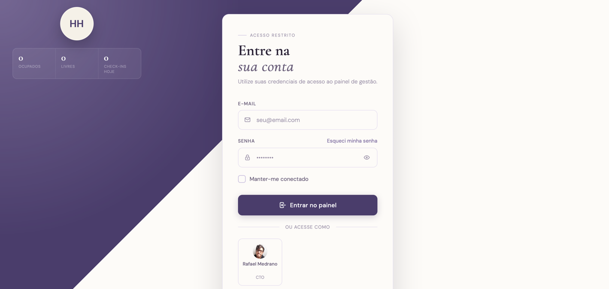
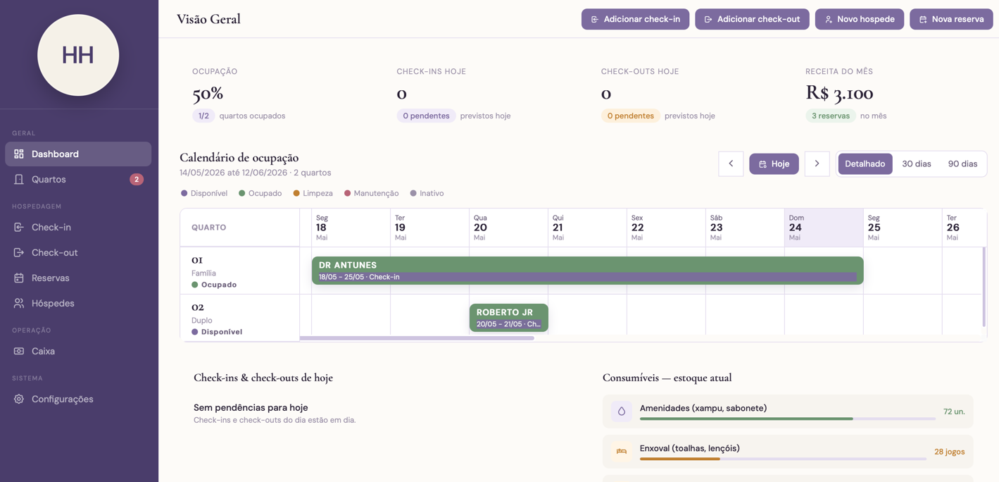

# HouseHost, gestão operacional e financeira para hospedagens

          

## Resumo

O HouseHost é um sistema fullstack para gestão operacional e financeira de pousadas, hotéis pequenos e hospedagens independentes. A aplicação centraliza reservas, hóspedes, quartos, check-ins, check-outs, estadias, caixa, transações financeiras, métricas de negócio e usuários administrativos em uma interface web estática e responsiva consumindo uma API REST em Spring Boot.

O projeto também foi usado como base para o Refúgio Cantinho das Lavandas, pousada em Monte Verde - MG. Nesse exemplo real de uso, eu implementei uma arquitetura de deploy em nuvem com AWS EC2, MySQL na instância, backend Spring Boot empacotado em `.jar`, serviço Linux com `systemd`, frontend estático servido pelo Nginx e proxy reverso para a API na porta interna `8080`.

Na prática, o HouseHost oferece uma estrutura inicial para:

- cadastrar e gerenciar hóspedes, quartos, reservas e estadias;
- realizar check-in e check-out com atualização de estados operacionais;
- registrar transações financeiras associadas a reservas, hóspedes e caixa;
- controlar entradas, saídas, valores liquidados e valores aguardando liquidação;
- usar um módulo financeiro desacoplado, criado para poder ser reaproveitado em outros sistemas e projetos com contextos diferentes;
- consultar métricas consolidadas para dashboard administrativo;
- autenticar usuários por e-mail e senha com JWT;
- proteger rotas internas com `Authorization: Bearer <token>`;
- manter contratos de API por DTOs e respostas padronizadas;
- entregar uma experiência responsiva para uso em desktop e telas menores;
- separar controller, service, repository, DTO, entidade e tratamento de exceções.

| Dashboard administrativo | Gestão operacional | Design responsivo                                                                                          |
| --- | --- |------------------------------------------------------------------------------------------------------------|
|  |  |  |

## Sumário

- [1. Introdução e motivação](#1-introdução-e-motivação)
  - [1.1. HouseHost como base para gestão de hospedagem](#11-househost-como-base-para-gestão-de-hospedagem)
  - [1.2. Objetivo do projeto](#12-objetivo-do-projeto)
- [2. Visão geral da arquitetura](#2-visão-geral-da-arquitetura)
  - [2.1. Camadas da aplicação](#21-camadas-da-aplicação)
  - [2.2. Organização do código](#22-organização-do-código)
  - [2.3. Tecnologias utilizadas](#23-tecnologias-utilizadas)
- [3. Protocolos, DTOs e segurança](#3-protocolos-dtos-e-segurança)
  - [3.1. Protocolo de response](#31-protocolo-de-response)
  - [3.2. DTOs de request e response](#32-dtos-de-request-e-response)
  - [3.3. Autenticação com JWT](#33-autenticação-com-jwt)
  - [3.4. Rotas públicas e protegidas](#34-rotas-públicas-e-protegidas)
- [4. Fluxo de request e response](#4-fluxo-de-request-e-response)
  - [4.1. Backend](#41-backend)
    - [4.1.1. Login e sessão JWT](#411-login-e-sessão-jwt)
    - [4.1.2. Cadastro e perfil de usuário](#412-cadastro-e-perfil-de-usuário)
    - [4.1.3. Cadastro de hóspede](#413-cadastro-de-hóspede)
    - [4.1.4. Criação de reserva](#414-criação-de-reserva)
    - [4.1.5. Check-in e check-out](#415-check-in-e-check-out)
    - [4.1.6. Liquidação financeira](#416-liquidação-financeira)
  - [4.2. Frontend](#42-frontend)
    - [4.2.1. Inicialização da interface](#421-inicialização-da-interface)
    - [4.2.2. API client e sessão local](#422-api-client-e-sessão-local)
    - [4.2.3. Views e widgets](#423-views-e-widgets)
- [5. Modelo de domínio](#5-modelo-de-domínio)
  - [5.1. User](#51-user)
  - [5.2. Guest](#52-guest)
  - [5.3. Room](#53-room)
  - [5.4. Booking](#54-booking)
  - [5.5. Stay, CheckIn e CheckOut](#55-stay-checkin-e-checkout)
- [6. Módulo financeiro, caixa e métricas](#6-módulo-financeiro-caixa-e-métricas)
  - [6.1. FinancialTransaction como API financeira](#61-financialtransaction-como-api-financeira)
  - [6.2. Transações parceladas](#62-transações-parceladas)
  - [6.3. Cashier, CashierEntry e CashierExpense](#63-cashier-cashierentry-e-cashierexpense)
  - [6.4. Métricas e dashboard](#64-métricas-e-dashboard)
- [7. API REST](#7-api-rest)
- [8. Tratamento de erros](#8-tratamento-de-erros)
- [9. Decisões de projeto](#9-decisões-de-projeto)
- [10. Refúgio Cantinho das Lavandas: exemplo real de uso e deploy](#10-refúgio-cantinho-das-lavandas-exemplo-real-de-uso-e-deploy)
  - [10.1. Contexto da pousada](#101-contexto-da-pousada)
  - [10.2. Arquitetura de nuvem](#102-arquitetura-de-nuvem)
  - [10.3. Backend como serviço Linux](#103-backend-como-serviço-linux)
  - [10.4. Nginx como servidor web e proxy reverso](#104-nginx-como-servidor-web-e-proxy-reverso)
  - [10.5. Ciclo de deploy](#105-ciclo-de-deploy)
- [11. Como rodar o HouseHost](#11-como-rodar-o-househost)
  - [11.1. Pré-requisitos](#111-pré-requisitos)
  - [11.2. Configuração do banco de dados](#112-configuração-do-banco-de-dados)
  - [11.3. Backend](#113-backend)
  - [11.4. Frontend](#114-frontend)
- [12. Como adicionar novos fluxos](#12-como-adicionar-novos-fluxos)
- [13. Próximos passos](#13-próximos-passos)

## 1. Introdução e motivação

Operações de hospedagem pequenas costumam nascer com controles separados: agenda para reservas, planilhas para pagamentos, conversas para dados do hóspede, anotações para check-in e outro controle para caixa. Esse modelo funciona no início, mas cria inconsistência quando o mesmo dado precisa aparecer em mais de uma tela ou quando uma ação operacional tem consequência financeira.

O HouseHost foi criado para concentrar essas informações em um fluxo único. Uma reserva representa o compromisso comercial. Uma estadia representa a presença real do hóspede no imóvel. Uma transação financeira representa uma intenção ou registro financeiro. Uma entrada ou saída representa movimento de caixa. Essa separação evita que uma reserva futura ocupe automaticamente um quarto, evita que dinheiro aguardando liquidação seja tratado como saldo em caixa e permite que o dashboard mostre uma visão coerente da operação.

### 1.1. HouseHost como base para gestão de hospedagem

O HouseHost pode servir como base para sistemas administrativos de pousadas, casas de temporada, hotéis pequenos e hospedagens independentes. A aplicação já possui módulos de autenticação, hóspedes, quartos, reservas, estadias, check-in, check-out, caixa, transações financeiras e métricas.

O ponto central é manter as regras de negócio no backend e deixar o frontend como consumidor da API. Controllers recebem requisições HTTP, services executam regras e repositories persistem dados. Essa organização permite evoluir o produto sem misturar regra financeira, regra operacional e renderização de tela.

### 1.2. Objetivo do projeto

O projeto cobre:

- cadastro e gestão de hóspedes;
- cadastro e gestão de quartos;
- criação, edição, exclusão e visualização de reservas;
- controle de status de reserva;
- check-in com criação ou associação de estadia;
- check-out com encerramento de estadia;
- criação de transações financeiras associadas a reservas;
- liquidação de pagamentos;
- criação automática de entradas e saídas no caixa;
- exibição de métricas operacionais e financeiras;
- perfil de hóspede, reserva e usuário;
- autenticação por e-mail e senha com token JWT;
- atualização de perfil, telefone, cargo, senha e foto de usuário.

## 2. Visão geral da arquitetura

O HouseHost segue uma arquitetura monolítica em camadas. Backend, regras de negócio, acesso a dados, segurança e frontend estático vivem no mesmo repositório, mas com responsabilidades separadas.

```text
Frontend estático
  |
  | fetch HTTP/JSON + Authorization: Bearer <token>
  v
JwtAuthenticationFilter / Spring Security
  |
  v
Controllers REST
  |
  v
Services de negócio
  |
  v
Repositories JPA
  |
  v
MySQL
```

Essa divisão permite que cada parte tenha uma responsabilidade clara. O controller não precisa conhecer detalhes de persistência. O service concentra validações e orquestrações. O repository encapsula consultas JPA. O filtro JWT autentica requisições antes de chegarem aos controllers protegidos.

### 2.1. Camadas da aplicação

- **Controller**: recebe requisições HTTP, delega para services e retorna `ResponseDTO`.
- **DTO**: define contratos de entrada e saída da API.
- **Service**: concentra regras de negócio, validações e orquestração entre módulos.
- **Repository**: encapsula acesso ao banco via Spring Data JPA.
- **Model/Entity**: representa o domínio persistido.
- **Security**: configura Spring Security, CORS, sessão stateless e filtro JWT.
- **Frontend Views/Widgets**: compõem telas e componentes visuais no navegador.

### 2.2. Organização do código

```text
src/main/java/com/househost
  auth/       autenticação, usuários e cargos
  booking/    reservas e pagamentos associados a reservas
  config/     compatibilidade de schema e configurações de startup
  finance/    caixa, transações financeiras, entradas e saídas
  guest/      hóspedes e status financeiro do hóspede
  metrics/    métricas consolidadas para dashboard
  room/       quartos
  security/   JWT, filtro de autenticação e configuração Spring Security
  shared/     DTO padrão e exceções globais
  stay/       estadias, check-ins e check-outs

frontend
  index.html
  css/
  js/
    api.js
    controllers/
    views/
    widgets/
```

Padrão interno por módulo backend:

```text
module/
  controller/
  dto/
  model/
  repository/
  service/
```

### 2.3. Tecnologias utilizadas

Backend:

- Java 21
- Spring Boot 3.2.5
- Spring Web
- Spring Data JPA
- Spring Security
- Spring Security Crypto
- JJWT
- Hibernate
- MySQL
- Maven Wrapper

Frontend:

- HTML estático
- CSS modular
- JavaScript ES Modules
- Fetch API
- `localStorage` para sessão JWT
- Tabler Icons via CDN
- Google Fonts

## 3. Protocolos, DTOs e segurança

Contratos são uma parte importante do HouseHost. A API não expõe entidades JPA diretamente: requests e responses passam por DTOs, e todas as respostas seguem o envelope `ResponseDTO`.

### 3.1. Protocolo de response

O protocolo `ResponseDTO` padroniza respostas de sucesso e erro.

```json
{
  "status": "success",
  "message": "Mensagem da operação",
  "data": {}
}
```

- `status`: indica sucesso ou erro.
- `message`: descreve o resultado da operação.
- `data`: carrega o conteúdo específico da resposta.

### 3.2. DTOs de request e response

Os DTOs isolam o contrato HTTP das entidades persistidas. Isso evita vazamento de campos sensíveis, permite respostas com dados derivados e mantém o frontend acoplado ao contrato da API, não ao modelo JPA.

Exemplos de DTOs:

- `LoginRequestDTO`
- `LoginResponseDTO`
- `RegistrationRequestDTO`
- `RegistrationResponseDTO`
- `UserProfileUpdateRequestDTO`
- `GuestRequestDTO`
- `GuestResponseDTO`
- `BookingFormCreateRequestDTO`
- `BookingResponseDTO`
- `FinancialTransactionRequestDTO`
- `FinancialTransactionResponseDTO`
- `CashierResponseDTO`
- `MetricsSummaryDTO`

### 3.3. Autenticação com JWT

O HouseHost usa Spring Security em modo stateless com JWT.

```text
POST /auth/login
  -> valida e-mail e senha com BCrypt
  -> gera JWT assinado
  -> retorna dados seguros do usuário + token
  -> frontend salva token em localStorage
  -> chamadas protegidas enviam Authorization: Bearer <token>
```

O token é gerado por `JwtService` usando JJWT. Ele possui:

- `sub`: e-mail do usuário autenticado;
- `jti`: identificador único do token;
- `iat`: data de emissão;
- `exp`: expiração;
- assinatura HMAC com chave configurada no service.

Tempo de expiração atual:

```text
expiresIn = 3600 segundos
```

Resposta resumida de login:

```json
{
  "status": "success",
  "message": "Login realizado com sucesso",
  "data": {
    "id": 1,
    "username": "admin",
    "email": "admin@househost.com",
    "phone": null,
    "role": "ADMIN",
    "photoUrl": null,
    "token": "jwt-assinado",
    "tokenType": "Bearer",
    "expiresIn": 3600
  }
}
```

### 3.4. Rotas públicas e protegidas

Rotas públicas:

```text
OPTIONS /**
GET     /
GET     /index.html
GET     /css/**
GET     /js/**
GET     /assets/**
GET     /favicon.ico
POST    /auth/login
POST    /auth/registration
GET     /auth/users/quick-access
```

Todas as demais rotas exigem JWT válido.

Exemplo de chamada autenticada:

```bash
curl -H "Authorization: Bearer SEU_TOKEN" http://localhost:8080/guests
```

Respostas de segurança:

```json
{
  "status": "error",
  "message": "Autenticação obrigatória.",
  "data": null
}
```

```json
{
  "status": "error",
  "message": "Token inválido ou expirado.",
  "data": null
}
```

## 4. Fluxo de request e response

O HouseHost usa REST para ações administrativas e financeiras. O frontend chama a API com `fetch`, recebe `ResponseDTO` e atualiza views/widgets de acordo com a resposta.

### 4.1. Backend

#### 4.1.1. Login e sessão JWT

```text
loginWidget.js
  |
  | e-mail + senha
  v
api.js -> login()
  |
  | POST /auth/login
  v
AuthController
  |
  v
AuthService
  |
  v
UserRepository + PasswordEncoder
  |
  v
JwtService gera token
  |
  v
ResponseDTO(LoginResponseDTO)
```

Depois do login, o frontend salva o token em `localStorage` e passa a enviar `Authorization: Bearer <token>` nas chamadas protegidas.

#### 4.1.2. Cadastro e perfil de usuário

```text
Frontend
  |
  | POST /auth/registration
  v
AuthController
  |
  v
AuthService
  |
  v
UserRepository
```

O cadastro valida duplicidade de username/e-mail, normaliza cargo para `UserRole`, codifica senha com BCrypt e salva `User`.

O perfil administrativo permite atualizar:

- nome;
- e-mail;
- telefone;
- cargo;
- foto;
- senha.

Para trocar senha, o backend exige senha atual correta e nova senha com pelo menos 8 caracteres.

#### 4.1.3. Cadastro de hóspede

```text
Frontend
  |
  | POST /guests
  v
GuestController
  |
  v
GuestService
  |
  v
GuestRepository
```

O perfil do hóspede agrega dados pessoais, histórico, reservas, estadias e transações. Se houver pagamentos pendentes ou em débito, o perfil exibe ações para liquidação.

#### 4.1.4. Criação de reserva

```text
Frontend
  |
  | POST /bookings/form
  v
BookingController
  |
  v
BookingService
  |
  +--> GuestRepository
  +--> RoomRepository
  +--> FinancialTransactionService
  |
  v
BookingRepository
```

Fluxo principal:

1. usuário escolhe hóspede por nome ou CPF;
2. escolhe quarto, período, origem e detalhes da hospedagem;
3. define dados de pagamento;
4. backend valida hóspede, quarto e período;
5. backend calcula valor total: diária x noites - desconto;
6. reserva é salva;
7. se há pagamento informado, cria uma transação financeira ou parcelada;
8. se `paymentCompleted = true`, a transação é liquidada imediatamente;
9. se `paymentCompleted = false`, a transação e suas entradas/saídas ficam aguardando.

Reservas `PENDING` e `CONFIRMED` bloqueiam período. Reserva cancelada não bloqueia período. Check-in realizado muda status para `GOT_CHECKIN`.

#### 4.1.5. Check-in e check-out

Check-in:

```text
POST /check-ins
  |
  v
CheckInService
  |
  +--> cria ou associa Stay
  +--> muda Booking para GOT_CHECKIN
  +--> muda Guest para IN_STAY
```

Check-out:

```text
POST /check-outs
  |
  v
CheckOutService
  |
  +--> encerra Stay
  +--> define checkout real
  +--> muda Guest para GOT_CHECKOUT
```

#### 4.1.6. Liquidação financeira

```text
PUT /financial-transactions/{id}/settle
  |
  v
FinancialTransactionService.toSettle(id)
  |
  +--> muda transação para SETTLED
  +--> liquida parcelas, se houver
  +--> liquida entradas/saídas do caixa
  +--> atualiza pagamento da reserva, se origem BOOKING
  +--> recalcula status financeiro do hóspede
```

Liquidar uma transação não é apenas trocar um texto de status. A ação tem efeitos contábeis e operacionais.

### 4.2. Frontend

#### 4.2.1. Inicialização da interface

```text
HTML carregado
  |
  v
main.js
  |
  +--> getStoredUser()
  |
  +--> se há usuário salvo: startUIController()
  |
  +--> se não há usuário salvo: renderAuthLayout()
```

#### 4.2.2. API client e sessão local

Arquivo:

```text
frontend/js/api.js
```

Responsabilidades:

- resolver a base da API;
- salvar `househost_token` no `localStorage`;
- salvar `househost_user` sem dados sensíveis do token;
- adicionar `Authorization: Bearer <token>` por padrão;
- permitir chamadas públicas com `{ auth: false }`;
- limpar sessão local ao receber HTTP 401.

Quando aberto fora da porta `8080`, o frontend usa `http://localhost:8080` como base da API.

#### 4.2.3. Views e widgets

Widgets:

- `loginWidget.js`
- `registrationWidget.js`
- `metricsResumeWidget.js`
- `sidebarWidget.js`
- `dashboardTopbarWidget.js`
- `roomTimelineWidget.js`

Views:

- dashboard;
- reservas;
- nova reserva;
- edição de reserva;
- perfil de reserva;
- hóspedes;
- perfil de hóspede;
- formulário de hóspede;
- quartos;
- formulário de quarto;
- check-in;
- check-out;
- caixa;
- perfil de usuário.

## 5. Modelo de domínio

### 5.1. User

Representa usuário administrativo da plataforma.

Campos principais:

- `username`
- `email`
- `phone`
- `passwordHash`
- `role`
- `photoUrl`

Cargos:

- `CEO`
- `CTO`
- `ADMIN`
- `MANAGER`
- `RECEPTION`
- `HOUSEKEEPING`

A senha nunca é salva em texto puro. O backend usa `PasswordEncoder` com BCrypt via `PasswordConfig`.

### 5.2. Guest

Representa a pessoa hospedada ou cliente que possui reservas.

Campos e conceitos principais:

- dados pessoais: nome, e-mail, telefone, documento, cidade, estado, endereço;
- tipo: `NOVO`, `REGULAR`, `VIP`;
- situação operacional: `IN_BOOKING`, `IN_STAY`, `GOT_CHECKOUT`;
- status financeiro: `WAITING_PAYMENT`, `PAYMENT_SETTLED`, `DEBTOR`;
- histórico: reservas, estadias e transações financeiras;
- preferências e observações.

O status financeiro do hóspede é derivado das transações associadas a ele:

1. se existe transação pendente com data passada, o hóspede fica `DEBTOR`;
2. se não está em débito, o sistema olha a transação mais recente;
3. se a última está liquidada/paga, fica `PAYMENT_SETTLED`;
4. se a última está aguardando, fica `WAITING_PAYMENT`.

### 5.3. Room

Representa quarto ou unidade de hospedagem.

Campos principais:

- número/nome do quarto;
- tipo;
- capacidade;
- diária;
- status.

Tipos:

- `SINGLE`
- `DOUBLE`
- `SUITE`
- `FAMILY`
- `STANDARD`

Status:

- `AVAILABLE`
- `OCCUPIED`
- `MAINTENANCE`
- `INACTIVE`

Uma reserva futura não deve, sozinha, tornar o quarto ocupado. Ocupação real depende de estadia ativa/check-in.

### 5.4. Booking

Representa a intenção comercial de hospedagem em um período.

Campos principais:

- hóspede;
- quarto;
- data de check-in;
- data de check-out;
- status;
- origem;
- quantidade de adultos, crianças e pets;
- forma de pagamento;
- parcelas;
- diária;
- desconto;
- valor pago;
- valor total;
- observações.

Status:

- `PENDING`
- `CONFIRMED`
- `CANCELLED`
- `GOT_CHECKIN`

Origem:

- `DIRETO_TELEFONE`
- `WHATSAPP`
- `INSTAGRAM`
- `BOOKING`
- `AIRBNB`
- `INDICACAO`

Status de pagamento da reserva não é salvo como campo independente. Ele é calculado a partir de `totalAmount` e `paidAmount`:

- `WAITING`: nada pago;
- `PARTIAL`: valor parcialmente pago;
- `PAID`: valor pago cobre o total.

### 5.5. Stay, CheckIn e CheckOut

`Stay` representa a presença real do hóspede no hotel. Uma reserva pode existir antes da estadia. A estadia nasce quando o check-in é realizado.

Status de `Stay`:

- `ACTIVE`
- `CHECKED_OUT`
- `CANCELLED`

`CheckIn` registra o evento operacional de entrada. Quando criado como `COMPLETED`, cria uma estadia ativa se ainda não existir, muda a reserva para `GOT_CHECKIN` e muda o hóspede para `IN_STAY`.

`CheckOut` registra o evento operacional de saída. Quando criado como `COMPLETED`, atualiza a estadia para `CHECKED_OUT`, define a data real de checkout e muda o hóspede para `GOT_CHECKOUT`.

## 6. Módulo financeiro, caixa e métricas

O módulo financeiro foi desenhado para ser desacoplado do restante da aplicação. Ele não depende rigidamente de reservas, estadias ou hóspedes para existir: esses módulos se conectam ao financeiro por origem (`sourceType` e `sourceId`) e por participantes (`senderType`, `senderId`, `receiverType`, `receiverId`). Essa decisão permite reaproveitar o mesmo módulo em outros sistemas e projetos, inclusive em contextos diferentes de hospedagem, como controle de caixa, contas a receber, contas a pagar ou movimentações internas.

### 6.1. FinancialTransaction como API financeira

`FinancialTransaction` funciona como uma API conceitual para solicitar movimentação financeira entre participantes.

Ela exige:

- tipo do pagante (`senderType`);
- id do pagante (`senderId`);
- tipo do recebedor (`receiverType`);
- id do recebedor (`receiverId`);
- valor;
- tipo da transação;
- data;
- descrição.

Participantes possíveis:

- `CASHIER`
- `GUEST`

Tipos:

- `STANDARD`
- `PLAN_SIGNAL_TRANSACTIONAL`
- `PLAN_TRANSACTIONAL`
- `INSTALLTMENT_PLAN_TRANSACTION`

Status:

- `WAITING`
- `SETTLED`
- `PAID`
- `ON_TIME`
- `LATE`
- `NOT_REALIZED`
- `PARTIALLY_REALIZED`
- `CANCELED`

A transação também pode guardar origem:

- `MANUAL`
- `BOOKING`
- `STAY`
- `CHECK_IN`
- `CHECK_OUT`
- `INSTALLMENT`
- `GUEST`

Para reservas:

```text
sourceType = BOOKING
sourceId = booking.id
```

Essa decisão evita uma relação rígida direta entre `Booking` e `FinancialTransaction`, mantendo a transação flexível como API financeira.

### 6.2. Transações parceladas

Quando uma reserva é criada com mais de uma parcela, o backend instancia `InstallmentPlanTransaction`, que herda de `FinancialTransaction`.

Esse plano possui parcelas (`InstallmentTransaction`) relacionadas. A liquidação do plano também atualiza as parcelas para status liquidado.

### 6.3. Cashier, CashierEntry e CashierExpense

O caixa não se relaciona diretamente com `FinancialTransaction`. Ele se relaciona com:

- `CashierEntry`: entrada;
- `CashierExpense`: saída.

Cada entrada/saída pode guardar a transação financeira de origem.

Quando uma transação é criada com status `WAITING`:

- entradas e saídas também nascem `WAITING`;
- o valor não entra em `cashOnHand`;
- o montante esperado altera `Cashier.onWaiting`.

Quando `toSettle` é chamado:

- transação vira `SETTLED`;
- entradas e saídas relacionadas viram `SETTLED`;
- valores saem de `onWaiting`;
- entradas aumentam `cashOnHand`;
- saídas diminuem `cashOnHand`;
- se a origem for `BOOKING`, a reserva registra pagamento.

### 6.4. Métricas e dashboard

Endpoint principal:

```text
GET /metrics/summary
```

O `MetricsService` consolida dados de:

- reservas;
- hóspedes;
- quartos;
- estadias;
- check-ins;
- check-outs;
- entradas do caixa;
- saídas do caixa.

Exemplos de métricas:

- total de reservas;
- reservas confirmadas;
- reservas com check-in realizado;
- hóspedes em estadia;
- hóspedes com reserva;
- quartos ocupados;
- quartos livres;
- check-ins esperados hoje;
- check-ins realizados hoje;
- check-outs esperados;
- receita mensal;
- saldo mensal do caixa.

Quartos ocupados são calculados por estadia ativa ou status operacional real, não por reserva futura isolada.

## 7. API REST

Com exceção das rotas públicas listadas em [3.4. Rotas públicas e protegidas](#34-rotas-públicas-e-protegidas), os endpoints abaixo exigem:

```http
Authorization: Bearer <token>
```

Autenticação:

```text
POST /auth/login               público, retorna JWT
POST /auth/registration        público
GET  /auth/users/quick-access  público
PUT  /auth/users/{id}          protegido
PUT  /auth/users/{id}/photo    protegido
```

Hóspedes:

```text
POST   /guests
POST   /guests/register
GET    /guests
GET    /guests/{id}
PUT    /guests/{id}
DELETE /guests/{id}
```

Reservas:

```text
POST   /bookings
POST   /bookings/form
GET    /bookings
GET    /bookings/{id}
GET    /bookings/guest/{guestId}
GET    /bookings/room/{roomId}
PUT    /bookings/{id}
DELETE /bookings/{id}
```

Quartos:

```text
POST   /rooms
GET    /rooms
GET    /rooms/{id}
PUT    /rooms/{id}
DELETE /rooms/{id}
```

Estadias:

```text
POST   /stays
GET    /stays
GET    /stays/{id}
GET    /stays/guest/{guestId}
GET    /stays/room/{roomId}
GET    /stays/booking/{bookingId}
PUT    /stays/{id}
DELETE /stays/{id}
```

Check-ins:

```text
POST   /check-ins
GET    /check-ins
GET    /check-ins/{id}
PUT    /check-ins/{id}
DELETE /check-ins/{id}
```

Check-outs:

```text
POST   /check-outs
GET    /check-outs
GET    /check-outs/{id}
PUT    /check-outs/{id}
DELETE /check-outs/{id}
```

Financeiro:

```text
POST   /financial-transactions
GET    /financial-transactions
GET    /financial-transactions/{id}
PUT    /financial-transactions/{id}
PUT    /financial-transactions/{id}/settle
DELETE /financial-transactions/{id}
```

Caixa:

```text
POST   /cashiers
GET    /cashiers
GET    /cashiers/{id}
PUT    /cashiers/{id}
DELETE /cashiers/{id}
```

Entradas:

```text
POST   /cashier-entries
GET    /cashier-entries
GET    /cashier-entries/cashier/{cashierId}
GET    /cashier-entries/{id}
PUT    /cashier-entries/{id}
DELETE /cashier-entries/{id}
```

Saídas:

```text
POST   /cashier-expenses
GET    /cashier-expenses
GET    /cashier-expenses/cashier/{cashierId}
GET    /cashier-expenses/{id}
PUT    /cashier-expenses/{id}
DELETE /cashier-expenses/{id}
```

Métricas:

```text
GET /metrics/summary
```

## 8. Tratamento de erros

O projeto centraliza exceções em `GlobalExceptionHandler`.

Na arquitetura, erros de negócio e erros de tecnologia são tratados em pontos diferentes:

- **Exceções de negócio**: nascem nos services quando uma regra do domínio é violada, como reserva inválida, hóspede inexistente, login incorreto, quarto indisponível ou transação financeira inconsistente. Elas são representadas por exceptions específicas de módulo e convertidas em `ResponseDTO` pelo `GlobalExceptionHandler`.
- **Exceções de tecnologia**: podem vir de infraestrutura, persistência, JSON, HTTP, banco de dados ou segurança. Quando são previstas pelo fluxo da aplicação, são normalizadas antes de chegar ao cliente. Quando vêm da autenticação JWT, podem ser tratadas antes do controller pelo filtro de segurança ou pelo `authenticationEntryPoint` do Spring Security.
- **Erros de autenticação**: são tratados no `JwtAuthenticationFilter` e em `SecurityConfig`, antes da requisição chegar ao controller protegido.

Cada módulo tem exceções próprias para representar falhas de negócio:

- `BookingException`
- `FinanceException`
- `GuestException`
- `InvalidLoginException`
- `RegistrationException`
- `RoomException`
- `StayException`

Erros de autenticação também seguem `ResponseDTO`, mas podem ser produzidos antes do controller:

- falta de token em rota protegida: HTTP 401 com mensagem `Autenticação obrigatória.`;
- token inválido ou expirado: HTTP 401 com mensagem `Token inválido ou expirado.`;
- e-mail/senha inválidos no login: HTTP 401 com mensagem `Usuário ou senha inválidos`.


## 9. Decisões de projeto

- Reserva não é estadia. Reserva é promessa comercial; estadia é hospedagem acontecendo.
- Status de pagamento da reserva é calculado a partir de `totalAmount` e `paidAmount`.
- `FinancialTransaction` não pertence rigidamente a `Booking`; ela guarda `sourceType` e `sourceId`.
- O módulo financeiro foi feito desacoplado para poder ser reutilizado em outros sistemas e projetos.
- Caixa conhece entradas e saídas, não contratos financeiros abstratos.
- Entradas e saídas `WAITING` alteram `onWaiting`, mas não `cashOnHand`.
- `GuestFinancialStatus` é recalculado a partir das transações associadas ao hóspede.
- `DatabaseSchemaCompatibilityRunner` existe para reduzir fricção em bancos já existentes.
- JWT protege a API, mas ainda não define autorização por cargo.
- Controllers são pequenos; services concentram regras de negócio.
- DTOs isolam API de entidades JPA.
- O frontend é uma SPA simples sem framework.
- Cache-busting manual usa query strings nos imports e CSS.
- Métricas ficam centralizadas em `/metrics/summary`.


## 10. Refúgio Cantinho das Lavandas: exemplo real de uso e deploy

### 10.1. Contexto da pousada

O Refúgio Cantinho das Lavandas é uma pousada em Monte Verde - MG usada como exemplo real de aplicação do HouseHost. O sistema foi adaptado para apoiar uma operação de hospedagem com reservas, hóspedes, quartos, check-ins, check-outs, caixa, métricas e autenticação administrativa.

Essa implantação foi feita por mim, Rafael Moreno dos Santos Medrano, incluindo a organização do backend, frontend, banco de dados, serviço Linux, Nginx e estrutura de deploy em AWS EC2.

### 10.2. Arquitetura de nuvem

A arquitetura de produção foi pensada para manter a aplicação simples, controlável e próxima de um cenário real de hospedagem:

```text
Usuário no navegador
  |
  | HTTP/HTTPS
  v
AWS EC2
  |
  v
Nginx porta 80/443
  |
  +--> serve frontend estático em /var/www/cantinho-das-lavandas
  |
  +--> proxy reverso para localhost:8080
         |
         v
      Spring Boot .jar
         |
         v
      MySQL local na EC2
```

Na EC2, a aplicação depende de:

- Java 21 para executar o backend Spring Boot;
- MySQL para persistência;
- Nginx para servir o frontend e encaminhar chamadas de API;
- `systemd` para manter o backend ativo em segundo plano;
- variáveis de ambiente externas ao Git para credenciais do banco.

### 10.3. Backend como serviço Linux

Em produção, o backend não roda com `./mvnw spring-boot:run`. O projeto é empacotado em um `.jar`:

```bash
./mvnw clean package
```

O artefato gerado fica em:

```text
target/househost-0.0.1-SNAPSHOT.jar
```

Na EC2, o `.jar` é executado pelo `systemd` como serviço chamado `cantinho-das-lavandas`. Esse serviço permite:

- iniciar automaticamente quando a instância liga;
- reiniciar o backend em caso de falha;
- consultar logs com `journalctl`;
- carregar variáveis de ambiente por um arquivo fora do repositório;
- manter a aplicação rodando sem depender de terminal aberto.

O arquivo de ambiente usado na EC2 fica fora do Git:

```text
/etc/cantinho-das-lavandas.env
```

Ele concentra variáveis como:

```text
HOUSEHOST_DB_URL
HOUSEHOST_DB_USERNAME
HOUSEHOST_DB_PASSWORD
```

### 10.4. Nginx como servidor web e proxy reverso

O Nginx fica na frente da aplicação e recebe o tráfego público nas portas `80` e `443`. O Spring Boot continua rodando internamente em:

```text
localhost:8080
```

Essa separação evita expor a porta `8080` publicamente e permite que o Nginx assuma duas responsabilidades:

- servir o frontend estático direto do disco;
- encaminhar chamadas de API para o backend Spring Boot.

O frontend fica separado do `.jar` em:

```text
/var/www/cantinho-das-lavandas
```

Com isso, alterações em HTML, CSS, JavaScript e assets podem ser publicadas sem recompilar o backend. Quando a mudança é apenas visual, basta sincronizar os arquivos estáticos e o Nginx passa a entregá-los. Quando a mudança é no backend, o `.jar` é atualizado e o serviço `cantinho-das-lavandas` é reiniciado.

### 10.5. Ciclo de deploy

O fluxo de deploy usado no exemplo do Refúgio Cantinho das Lavandas segue esta lógica:

1. atualizar o código na EC2 ou enviar artefatos pela máquina local;
2. compilar o backend com Maven quando houver mudança Java;
3. substituir o `.jar` em `target/`;
4. reiniciar o serviço `cantinho-das-lavandas` com `systemctl`;
5. sincronizar `frontend/` para `/var/www/cantinho-das-lavandas` quando houver mudança visual;
6. testar a configuração do Nginx com `sudo nginx -t`;
7. recarregar o Nginx quando houver mudança de configuração;
8. consultar logs do backend com `journalctl -u cantinho-das-lavandas`;
9. manter o Security Group expondo apenas portas necessárias, como `80`, `443` e `22` restrita.

Essa arquitetura de deploy e nuvem foi implementada por mim para transformar o HouseHost em uma aplicação executável em ambiente real, com backend Java isolado, frontend estático independente, proxy reverso e banco persistente na EC2.


## 11. Como rodar o HouseHost

### 11.1. Pré-requisitos

- Java 21
- MySQL
- Maven Wrapper incluso no projeto

### 11.2. Configuração do banco de dados

Crie um arquivo `.env` na raiz, baseado em `.env.example`:

```bash
HOUSEHOST_DB_URL=jdbc:mysql://localhost:3306/househost?createDatabaseIfNotExist=true&serverTimezone=UTC
HOUSEHOST_DB_USERNAME=root
HOUSEHOST_DB_PASSWORD=sua_senha
```

Configuração principal em `src/main/resources/application.properties`:

```properties
spring.datasource.url=${HOUSEHOST_DB_URL:jdbc:mysql://localhost:3306/househost?createDatabaseIfNotExist=true&serverTimezone=UTC}
spring.datasource.username=${HOUSEHOST_DB_USERNAME:root}
spring.datasource.password=${HOUSEHOST_DB_PASSWORD:}
spring.jpa.hibernate.ddl-auto=update
spring.jpa.show-sql=true
```

O projeto usa `ddl-auto=update` para evolução automática básica do schema em desenvolvimento.

Também existe o `DatabaseSchemaCompatibilityRunner`, que roda no startup e aplica ajustes específicos no MySQL. Ele foi criado porque algumas mudanças de enum, colunas novas e migrações de valores antigos não são sempre resolvidas bem apenas com `ddl-auto=update`.

Responsabilidades do runner:

- garantir enums atualizados;
- adicionar colunas novas;
- normalizar valores antigos;
- criar o caixa principal quando necessário;
- manter compatibilidade com bancos já existentes;
- sincronizar status de hóspedes a partir de estadias.

### 11.3. Backend

```bash
./scripts/run-dev.sh
```

Ou, exportando as variáveis manualmente:

```bash
./mvnw spring-boot:run
```

Por padrão, o backend roda em:

```text
http://localhost:8080
```

Para rodar testes:

```bash
./mvnw test
```

### 11.4. Frontend

O frontend está em:

```text
frontend/index.html
```

Quando aberto fora da porta `8080`, `frontend/js/api.js` usa `http://localhost:8080` como base da API.


## 12. Como adicionar novos fluxos

Para adicionar um novo fluxo no backend:

1. crie ou atualize DTOs de request/response;
2. adicione ou ajuste a entidade de domínio, se necessário;
3. crie o repository ou método de consulta;
4. implemente a regra no service;
5. exponha o endpoint no controller;
6. retorne sempre `ResponseDTO`;
7. atualize o frontend em `api.js`;
8. crie ou ajuste view/widget;
9. documente endpoints, estados e efeitos colaterais no README ou em `docs/`.

Para fluxos financeiros, também verifique:

- impacto em `Cashier.cashOnHand`;
- impacto em `Cashier.onWaiting`;
- criação ou liquidação de `CashierEntry`;
- criação ou liquidação de `CashierExpense`;
- atualização de reserva quando `sourceType = BOOKING`;
- atualização do status financeiro do hóspede.


## 13. Próximos passos

- criar autorização por cargo;
- mover a chave JWT para variável de ambiente;
- adicionar refresh token ou renovação controlada de sessão;
- substituir `ddl-auto=update` por Flyway ou Liquibase;
- adicionar testes unitários para services principais;
- adicionar testes de segurança para rotas públicas, rotas protegidas e token expirado;
- adicionar testes de integração para fluxos de reserva, check-in e financeiro;
- criar build formal do frontend ou migrar para ferramenta leve se necessário;
- versionar contratos da API;
- adicionar auditoria de movimentações financeiras;
- melhorar relatórios financeiros;
- criar agenda/calendário de reservas com filtros;
- adicionar controle de consumo e manutenção quando esses módulos forem retomados.


## Autor

Rafael Moreno dos Santos Medrano

[](https://github.com/RafaelSMedrano) [](https://www.linkedin.com/in/rafaelsmedrano/) [](mailto:rafael.smedrano@gmail.com)

Projeto desenvolvido como sistema administrativo para gestão de hospedagem, com foco em modelagem de domínio, arquitetura em camadas, operação hoteleira e controle financeiro.
